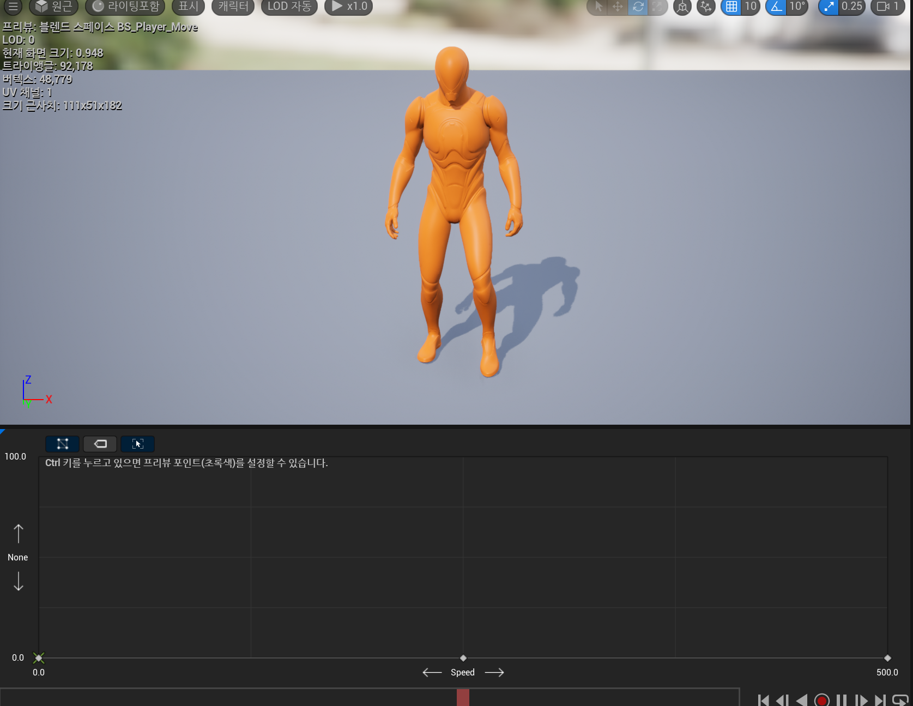

## 1 Animation 설정


> Animation Instance Class
> Animation을 만드는데 필요한 데이터들을 모아두는 Class를 만들었다.

AnimInstance를 부모로 상속 받은 AnimationInstance Class를 파서 BluePrint에 연결해줬다.

```cpp
public :
	virtual void NativeInitializeAnimation() override; // 한 번 초기화
	virtual void NativeUpdateAnimation(float DeltaSeconds) override; // Tick의 역할

```
**NativeInitializeAnimation()** 란 애니메이션 초기화를 담당하며,
**NativeUpdateAnimation(float DeltaSeconds)** 란 애니메이션 매 업데이트를 담당한다.


```cpp
protected :
	UPROPERTY(BlueprintReadOnly)
	FVector m_vVelocity			= FVector::ZeroVector;

	UPROPERTY(BlueprintReadOnly)
	float m_fGroundSpeed		= 0.f;

	UPROPERTY(BlueprintReadOnly)
	bool m_bShouldMove		= false;

	UPROPERTY(BlueprintReadOnly)
	bool m_bIsFalling				= false;
```
Animation Instance Class에는 애니메이션을 작동하기 위하여 필요한 상태 멤버 변수를 선언하였다.

## 2 Animation Graph


## 3 Blend Space
입력 매개 변수를 기반으로 여러 개의 애니메이션을 블렌딩할 수 있도록 만들어준다. 그래프에서 샘플링하여 입력 값을 블렌딩 시켜준다.

DX11에서 애니메이션 뼈대를 보간하기 위해서 꽤 애를 먹었는데 Frame 단위로 Animation을 대입해서 자동 보간이 참으로 직관적이고 편리하다.
